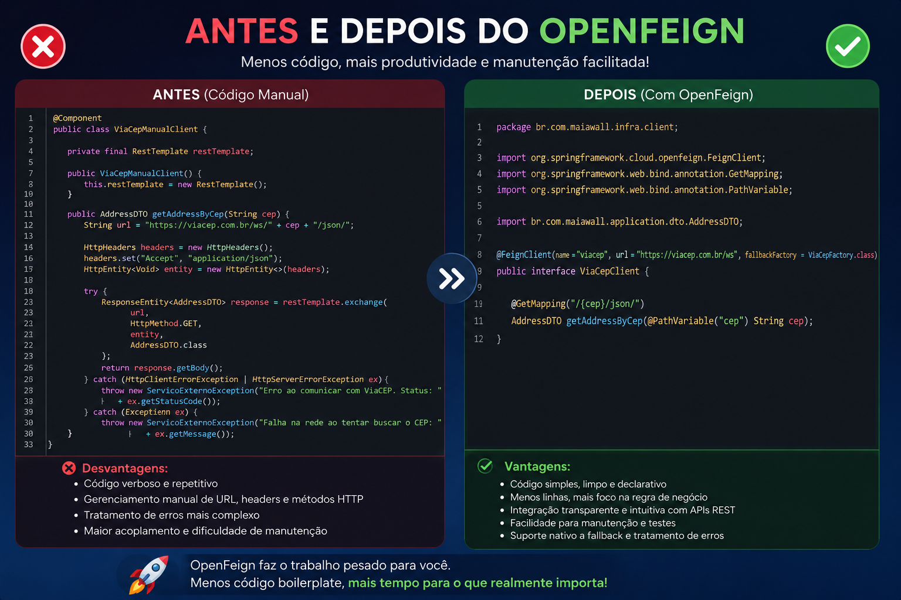

# Maiawall — Exemplo prático de OpenFeign com Spring Boot

Este repositório é um projeto de **estudo focado no uso do OpenFeign** para consumo de APIs externas dentro de uma aplicação Spring Boot. A API gerencia pessoas e busca seus endereços automaticamente via [ViaCEP](https://viacep.com.br).



## O que é o OpenFeign?

OpenFeign é um cliente HTTP declarativo do Spring Cloud. Em vez de escrever código boilerplate com `RestTemplate` ou `WebClient`, você define uma **interface Java** e o Feign cuida do resto.

## Como está implementado aqui

### 1. Dependências (`pom.xml`)

```xml
<!-- Cliente HTTP declarativo -->
<dependency>
    <groupId>org.springframework.cloud</groupId>
    <artifactId>spring-cloud-starter-openfeign</artifactId>
</dependency>

<!-- Circuit Breaker — habilita o fallback do Feign via Resilience4j -->
<dependency>
    <groupId>org.springframework.cloud</groupId>
    <artifactId>spring-cloud-starter-circuitbreaker-resilience4j</artifactId>
</dependency>
```

> O Feign sozinho **não sabe o que fazer quando a API externa falha**. O Resilience4j é o mecanismo que monitora as chamadas e aciona o fallback quando algo dá errado — sem ele, o `fallbackFactory` no `@FeignClient` é simplesmente ignorado.

### 2. Habilitando o Feign (`MaiawallApplication.java`)

```java
@SpringBootApplication
@EnableFeignClients  // <- habilita o escaneamento das interfaces Feign
public class MaiawallApplication { ... }
```

### 3. A interface do cliente (`ViaCepClient.java`)

Basta declarar a interface — o Feign gera a implementação automaticamente em tempo de execução.

```java
@FeignClient(name = "viacep", url = "https://viacep.com.br/ws", fallbackFactory = ViaCepFactory.class)
public interface ViaCepClient {

    @GetMapping("/{cep}/json/")
    AdressDTO getAddressByCep(@PathVariable("cep") String cep);
}
```

### 4. Fallback com FallbackFactory (`ViaCepFactory.java`)

O **Resilience4j** monitora as chamadas do Feign. Quando detecta uma falha (timeout, erro HTTP, serviço fora do ar), ele aciona o `FallbackFactory` em vez de deixar a exceção estourar para o cliente.

A vantagem do `FallbackFactory` sobre um `Fallback` simples é ter acesso à **causa da falha** (`Throwable cause`), permitindo respostas diferentes por tipo de erro:

```java
@Component
public class ViaCepFactory implements FallbackFactory<ViaCepClient> {

    @Override
    public ViaCepClient create(Throwable cause) {
        return cep -> {
            if (cause instanceof FeignException && ((FeignException) cause).status() == 404) {
                // CEP não existe na base do ViaCEP
                return new AdressDTO(cep, "CEP Inexistente", "", "", "", "");
            }
            // Qualquer outro erro (timeout, 500, rede...)
            return new AdressDTO(cep, "Serviço Indisponível", "", "", "", "");
        };
    }
}
```

### 5. Usando o cliente num Use Case (`PearsonAdressByIdUseCase.java`)

O cliente é injetado como qualquer outro bean — zero configuração extra.

```java
@Service
public class PearsonAdressByIdUseCase {

    private final ViaCepClient viaCepClient;

    public AdressDTO execute(Long id) {
        var pearson = pearsonByIdUseCase.execute(id);
        return viaCepClient.getAddressByCep(pearson.cep()); // <- Feign em ação
    }
}
```

## Fluxo completo

```
GET /pearson/{id}/adress
        │
        ▼
PearsonAdressByIdUseCase
        │
        ├── busca a pessoa no banco → PersonRepo
        │
        └── chama ViaCepClient.getAddressByCep(cep)
                │
                ├── [sucesso] ──────────────────────→ retorna AdressDTO com dados reais
                │
                └── [falha] → Resilience4j detecta → ViaCepFactory.create(cause)
                                                            │
                                                            ├── 404 → "CEP Inexistente"
                                                            └── outro → "Serviço Indisponível"
```

## Como rodar

```bash
./mvnw spring-boot:run
```

Teste o fluxo do Feign:

```bash
# Cria uma pessoa com CEP
POST http://localhost:8080/pearson
{ "name": "João", "cep": "01001000" }

# Busca o endereço via ViaCEP (passa pelo Feign + Resilience4j)
GET http://localhost:8080/pearson/{id}/adress
```
